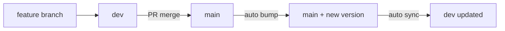
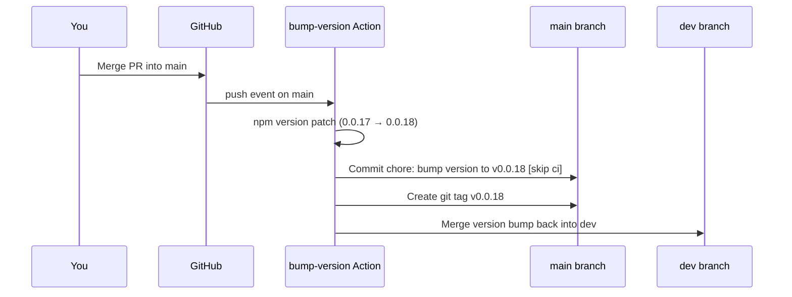
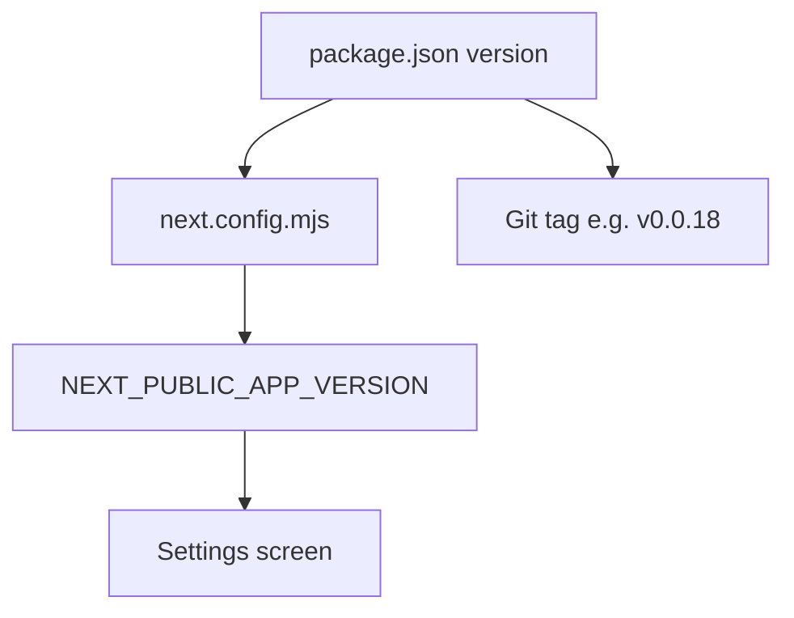
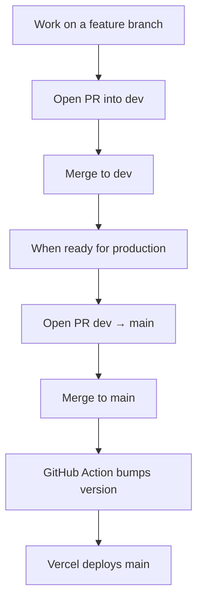

# Versioning in this project

This app uses a simple **patch-only** version number stored in `package.json` (for example `0.0.18`). You do **not** bump the version by hand during normal development — a GitHub Action does it automatically whenever code is merged into `main`.

The version is shown in the app under **Settings → Pockett version**, read from `package.json` at build time via `next.config.mjs`.

---

## Branches

| Branch | Role |
|--------|------|
| **`dev`** | Day-to-day development. Merge feature work here. |
| **`main`** | Production. Merging into `main` = a release. |



---

## What happens on a release (merge to `main`)

When a pull request is merged into `main`, the workflow [`.github/workflows/bump-version.yml`](workflows/bump-version.yml) runs:



**Step by step:**

1. **Trigger** — Any push to `main` (usually a merged PR).
2. **Bump** — `npm version patch` increases the last number in `package.json` (`0.0.17` → `0.0.18`).
3. **Commit & tag** — The bot commits only `package.json`, tags the release (e.g. `v0.0.18`), and pushes to `main`.
4. **Sync to `dev`** — The same version change is merged into `dev` so both branches stay aligned.

Commit messages look like:

```
chore: bump version to v0.0.18 [skip ci]
```

The `[skip ci]` suffix stops this bump commit from triggering the workflow again (which would cause an endless loop).

---

## Where the version lives



| File / place | Purpose |
|--------------|---------|
| `package.json` → `"version"` | Single source of truth |
| `next.config.mjs` | Injects version into the Next.js build |
| `components/views/Settings.tsx` | Shows **Pockett version** in the UI |
| Git tag (`v0.0.18`) | Marks each release in GitHub |

Only **`package.json`** is changed by the workflow. Lockfiles are not updated.

---

## Version format

We use three numbers: **`MAJOR.MINOR.PATCH`** (semver-style).

Right now the workflow only bumps **PATCH** (the third number):

```
0.0.17  →  0.0.18  →  0.0.19  …
```

Minor and major bumps are not automated. Change those manually in `package.json` if you ever need them.

---

## Your workflow as a developer



1. Build features on a branch, merge into **`dev`**.
2. When ready to ship, open a PR from **`dev`** → **`main`** and merge it.
3. The Action bumps the version; Vercel deploys **`main`** automatically.
4. Check **Settings** in the live app to confirm the new version.

**Do not** edit `package.json` version on feature branches — let the Action handle it on release.

---

## If the automatic bump did not run

The workflow depends on **GitHub Actions**. If Actions is down or the run failed, `main` can merge without a version bump.

**Check:** GitHub → **Actions** → **Bump version on release** — look for a run on your merge commit.

**Fix manually** (same commit message as the bot):

```bash
# On main
git checkout main && git pull
# Edit package.json: bump patch number (e.g. 0.0.17 → 0.0.18)
git add package.json
git commit -m "chore: bump version to v0.0.18 [skip ci]"
git push origin main

# Sync dev
git checkout dev && git pull
# Same version in package.json
git add package.json
git commit -m "chore: bump version to v0.0.18 [skip ci]"
git push origin dev
```

Optional: create the matching tag on `main`:

```bash
git tag v0.0.18 && git push origin v0.0.18
```

---

## Quick reference

| Question | Answer |
|----------|--------|
| When does the version change? | After a merge/push to **`main`** |
| Who bumps it? | GitHub Actions bot (`github-actions[bot]`) |
| What gets bumped? | Patch only (`0.0.x`) |
| Which file? | `package.json` only |
| Why `[skip ci]`? | Prevents the bump from retriggering the same workflow |
| Why sync to `dev`? | So dev and main show the same version number |

Workflow source: [`.github/workflows/bump-version.yml`](workflows/bump-version.yml)
